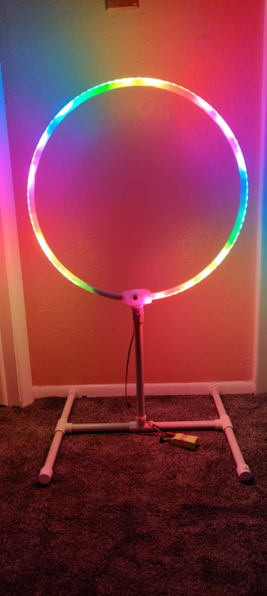
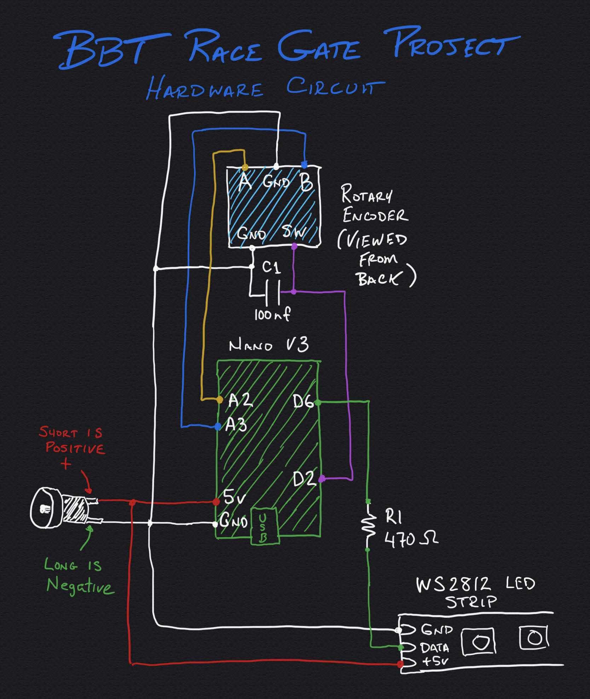
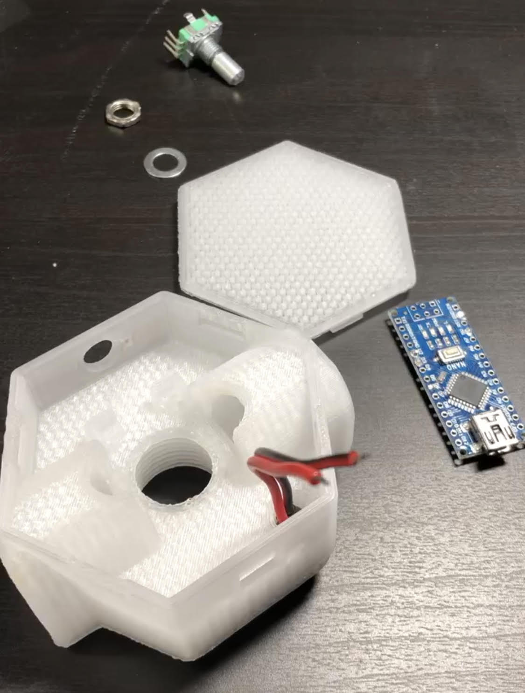

# 

This project is an extension of the original code I created for the BBT Tiny Whoop Race Gates. 
I've expanded and simplified the code and schematics for use with a new open-source project.

These gates were (at one time) under BrightBlue and we have joined the [Hydra FPV](https://www.hydrafpv.com/) family. 
We are dedicated to teaching youth about electronics, robotics, and programming through competition via drone racing.

# Table of Contents
1. [Social](#social)
2. [Releases](#releases)
3. [Features](#features)
4. [Overview](#overview)
5. [Electronics](#electronics)
6. [Hardware](#Hardware)
7. [Firmware](#firmware)
8. [Stands](#stands)
9. [Power](#power)
10. [Contributing](#contributing)
11. [License](#license)

# Social
Find us at [BBT Race Gate Project - Open Source](https://www.facebook.com/groups/BBTRaceGateProject/)

# Releases
The latest release can be found in [Latest Releases](https://github.com/Teknoid303/BBTRaceGateProject/releases).

# Features

- **Easy to Build** - This design makes use of two 3D printed parts, PEX water pipe, an Arduino NANO board, and some easily ordered parts.
- **Expandable Sizes** - [MultiGP specs for Tiny Whoop race gates](https://drive.google.com/file/d/0BxRbCdCm27o1R1luRWhKbHprbDA/view?usp=sharing) are specific, but these gates can be made in any size you desire.
- **Easily Mountable** - The 1/2" NPT PVC pipe thread built into the bottom of the base allows you to securely attach the gate to any stand, hanger, or wild contraption you can build with PVC pipes and components. Let your imagination run wild... or just use some of my [example stands](#stands).
- **Automatic Changing Patterns** - The gate automatically switches between 14 different lighting patterns (to be expanded)
- **Locked Pattern Mode** - If you prefer to use one pattern, you can lock a gate to that pattern.
- **Random Pattern Mode** - Randomize the patterns to insure your whole course is different.
- **Adjustable Brightness Control** - Different venues require different brightness levels. Or, keep them super bright before the race to attract attention to your race, then back them down for racing.
- **Save Preferences for Next Power On** - This feature will save you time on course setup. If you prefer a specific mode, color, pattern, or brightness, you can lock your gates to those preferences and they will power up in that mode every time. This is also very convenient to use if the gates are mounted in a difficult to access location, like in the rafters or hanging from your ceiling.
- **Erase Saved Preferences** - Just in case you change your mind.

# Overview

(Video coming soon)

To enter specific display modes:

1. **Select Brightness** - Turn the selector to the desired brightness. The gate will progressively show a dial to represent brightness.
2. **Select Pattern** - Press the selector in (button) to select the pattern you like and it will hold that pattern.
3. **Return to Sequence Mode** - Press the button and hold until the first gate segment lights up. Release and you will start progressing through the patterns again, once every 20 seconds.
4. **Random Mode** - Press the button and hold until the second gate segment lights up. It will flash green. This is randomize mode, where the patterns come in random order every 20 seconds.
5. **Save Settings** - Change all the above parameters to your desired setup, then hold the button down until the third segment of the gate lights up. Before the red countdown reaches zero, do the same thing again to confirm. A blue flash will confirm that the settings were saved.
6. **Erase Settings** - Do the same as above, but wait for the fourth segment to light up. All settings will be erased.

# Electronics
# 

# Hardware
According to the MultiGP Tiny Whoop racing specs, the maximum area of a gate is 361 square inches or less. That works out to a circumference of about 67" and will result in a nearly 21.5" diameter gate. There is a 1" gap introduced in the 3D base mount, so 66" section of PEX pipe should be perfect. This will fit about 106 LEDs when the strand is flattened and pulled to center.

[Thingiverse Project](https://www.thingiverse.com/thing:4101973)

## Parts List 

According to the MultiGP Tiny Whoop racing specs, the maximum area of a gate is 361 square inches or less. That works out to a circumference of about 67" and will result in a nearly 21.5" diameter gate. There is a 1" gap introduced in the 3D base mount, so 66" section of PEX pipe should be perfect. This will fit about 100 LEDs when the strand is flattened and pulled to center. That's 3 gates per roll of LEDs.

# The Build

(Video coming soon)

For those of you anxious to get moving and you have the parts, there are a few details you'll need to know. The NANO boards are "generally" the same size, but this is generous. My experience of snapping one board into place while designing the box was an outlier. SO, I changed it to allow several different board sizes. If your NANO board is loose, take a soldering iron and melt the tabs over the top of your board (near the encoder end). It will lock it in place.

- Prepping the PEX - Unless you want to promote SharkBite brand PEX piping, you will probably want to remove the writing. You will need a specific chemical, [Oatey PVC Clear Cleaner](https://www.homedepot.com/p/Oatey-16-oz-PVC-Clear-Cleaner-307953/202329481) or the like. Acetone, sandpaper, paint thinner, none of them work. And don't get the purple version unless you want purple gates. 

First off, ONLY DO THIS OUTDOORS OR IN AN OPEN GARAGE. This stuff is noxious and can really take away some brain cells along with the printing. Wear chemical gloves, although you might have to change them often. A simple wipe of the printing with a paper towel will remove the print. Oh... and did I mention ONLY DO THIS OUTDOORS??? :)

The LEDs look their best flattened against the inner side of the pipe. I've tried to stick them to the inner part of the tube, but it can be difficult to do. The only way it's worked for me is attaching a string or fishing line to the end of the LED strip, fish the entire thing into the tube, untying the fishing line, attaching it to the paper cover over the tape and pull it back the other way SLOWLY. If it messes up, it's difficult to fix it.

# Firmware
Uploading the included sketch (src/BBTRaceGateProject.ino) into the [Arduino IDE](https://www.arduino.cc/en/Main/Software) and uploading it to the board via USB. There are several debug methods that can be used if necessary, but I'll address those as they come up.

The #1 most common issue arises here with clone Arduino NANOs, which is nearly all of them these days, is an incorrect Bootloader on the device. Arduino tried to change the bootloader when the clones started showing up, but eventually gave in to the onslaught and included it in their IDE. 

Under Tools, select Board "Arduino Nano". Under Processor, select "ATmega328P". If the upload times out using that processor, switch to "ATmega328P (Old Bootloader)". That should work. If not, I'll have a debug clinic up soon.

Update: Maybe they completely gave in. There is now an "Arduino Nano Every" selection in the board list. Try it out and tell me what you find.

# Stands
Portability is a major factor for our Whoop races in Northern Colorado. We have several different venues, one kit, and nowhere to setup a permanent track. Based on this, I built in a 1/2" NPT threaded mount in the bottom of my electronics boxes. This way, I could just purchase PVC pipes and fittings from my local hardware store and create almost any configuration I wanted. AND, it would be portable!

I will be posting a document here expanding on the world of possibilities for stands. :)

# Power
Unlike my previous gates, these are limited to 5v power only to simplify the design. You can easily purchase 5v power supplies that fit the 5.5mm x 2.1mm barrel plug in the electronics base. You can go with "wall-warts" and extension cords. OR, a centralized 5v higher-power supply (like 25 or 30 watts) and use two conductor wire and ends attached. There are a ton of surveillance video applications available for use. OR, you can create small "dongles" that convert a 3S or 4S battery to 5 volts. 
I have a video in the works to cover all these methods.

# Contributing
Any contributions are welcome! Patterns. Hardware. Firmware. Optimization.

Please follow [CONTRIBUTING.md](CONTRIBUTING.md) for standard practices regarding this repo.

## Recognition
- Parts based on Demo Reel by [Mark Kriegsman](<kriegsman@tr.org>), December 2014 (functions for hue cycle and next_pattern. Patterns rainbow, rainbowWithGlitter, confetti, bpm, and juggle. sinelon is also included but not displayed)
- Patterns three_sin_pal and blendme based off of a database by Andrew Tuline [atuline](https://github.com/atuline), January 2017
- "Marquee fun" and gradient_fill patterns by Marc Miller, May 2016
- Functions displayStateMachine, brightnessControl (function and method), rotary encoder methods, randModeDisplay, countdownDisplay, eepromConfirm, ConstantColorX, randomColorFill, and randomPattern by Dean Nicholson, 2018, 2019, 2020

# License

### Code
The code is distributed under the [GNU Lesser General Public License v3.0](LICENSE.md).

### 3D Files
The 3D base and lid files (here and Thingiverse) are distributed under the [Creative Commons Attribution 4.0 International](http://creativecommons.org/licenses/by/4.0/) license.
