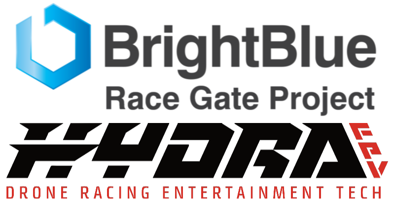

# 

This project is an extension of the original code I created for the BBT Tiny Whoop Race Gates. 
I've expanded and simpified the code and schematics for use with a new open-source project.

These gates were (at one time) manufactured under my company, [Bright Blue Tech](https://www.facebook.com/BrightBlueDroneTech/)

# Table of Contents
1. [Releases](#releases)
2. [Features](#features)
3. [Overview](#overview)
4. [Hardware](#hardware)
5. [Firmware](#firmware)
6. [Contributing](#contributing)
7. [License](#license)

# Releases
The latest release can be found here. [Latest Releases](insert project here)

# BBTRaceGateEncoder
The original code used on the BBT Tiny Whoop race gates, expanded and simplified for use with a new open-source project.
